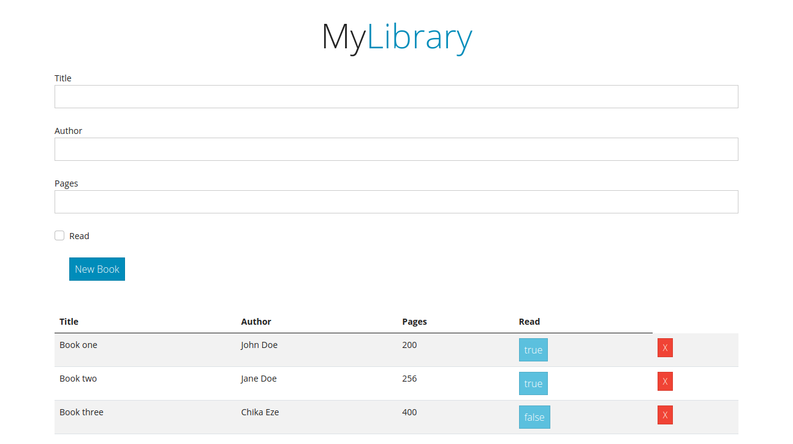

# libraryProject
This project involves building a library where books with the authors, number of pages, and status are displayed.

## Built With

- HTML
- CSS
- Bootswatch
- Javascript

## Live Demo

# Getting Started

- $ git clone `$ git clone git@github.com:JulianaOsemeke/libraryProject.git`
- Run `cd libraryProject`

## Authors

👤 **Juliana Osemeke**
- GitHub: [@githubhandle](https://github.com/JulianaOsemeke)
- LinkedIn: [LinkedIn](https://www.linkedin.com/in/juliana-osemeke/)

👤 **Olaoluwa Soladoye**
- GitHub: [@Crappypapa](https://github.com/crappypapa)
- Twitter: [@Laoluwa](https://twitter.com/_laoluwa)
- LinkedIn: [Olaoluwa](https://www.linkedin.com/in/olaoluwa-soladoye)